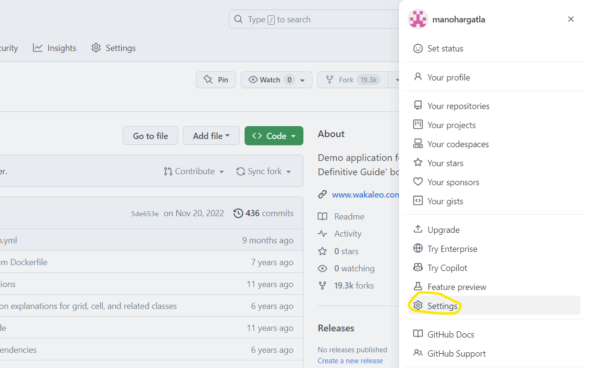
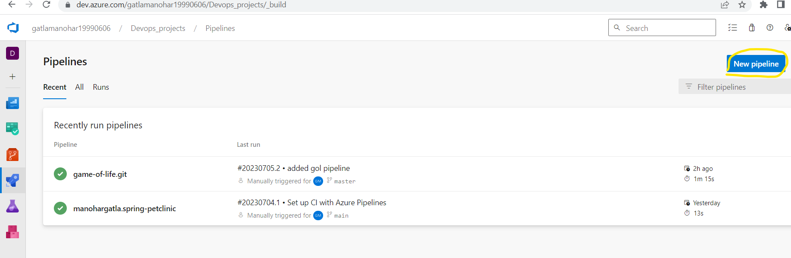

# Azure_Devops
* Azure DevOps provides an integrated set of services and tools to manage your software projects, from planning and development through testing and deployment.
* Azure DevOps is a cloud-based platform that provides a suite of tools for managing the entire software development lifecycle.
* Azure DevOps can be used by two ways
    *** Self-hosted agent:** An agent that you set up and manage on your own to run jobs is a self-hosted agent. Self-hosted agents give you more control to install dependent software needed for your builds and deployments.
    * **Microsoft hosted agent:** Microsoft-hosted agents are run in individual VMs, which are re-imaged after each run. Each agent is dedicated to a single organization, and each VM hosts only a single agent. There are several benefits to running your pipeline on Microsoft-hosted agents, from a security perspective.
* Githud authentication through ssh private key

* Cloning Repo from Azure repos before that import repo into Azure repo

# Creating Pipelines in Azure DevOps Projects
* Click on New pipeline and Select Source code repo from below

* Select pipeline save and Run

* After artifacts gets published we can download it from by clicking on Artifact given below

# Setting up Self-Hosted agent in Azure DevOps (Configuration)
* Create a One linux virtual machine or Ec2 Instance and follow the below steps
* Go to Projects settings and click on Agentpool then select Default click on New agent

* Create a Personal token access for configuration of selfhosted agent
 

